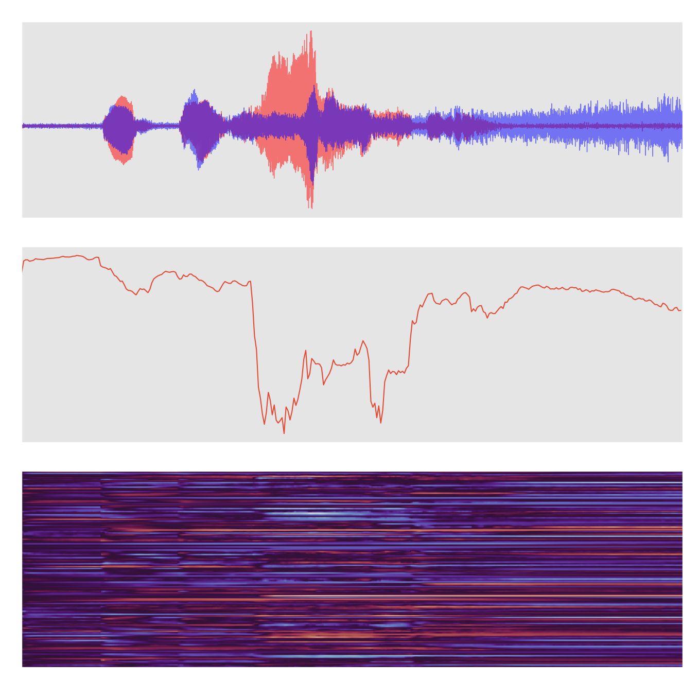

# Non-Intrusive Speech Intelligibility Prediction from Discrete Latent Representations

Official repository for paper "Non-Intrusive Speech Intelligibility Prediction from Discrete Latent Representations".

> This public repository is a work in progress! Results here bear no
> resemblance to results in the paper!

We predict the intelligibility of binaural speech signals by first extracting latent representations from raw audio. Then, a lightweight predictor over these latent representations can be trained. This results in improved performance over predicting on spectral features of the audio, despite the feature extractor not being explicitly trained for this task. In certain cases, a single layer is sufficient for strong correlations between the predictions and the ground-truth scores.

This repository contains:
- `vqcpc/` - Module for VQCPC model in PyTorch
- `stoi/` - Module for Small and SeqPool predictor model in PyTorch
- `data.py` - File containing various PyTorch custom datasets
- `main-vqcpc.py` - Script for VQCPC training
- `create-latents.py` - Script for generating latent dataset from trained VQCPC
- `plot-latents.py` - Script for visualizing extracted latent representations
- `main-stoi.py` - Script for STOI predictor training
- `main-test.py` - Script for evaluating models
- `compute-correlations.py` - Script for computing metrics for many models
- `checkpoints/` - trained checkpoints of VQCPC and STOI predictor models
- `config/` - Directory containing various configuration files for experiments
- `results/` - Directory containing official results from experiments
- `dataset/` - Directory containing metadata files for the dataset
- `data-generator/` - Directory containing dataset generation scripts (MATLAB)

All models are implemented in PyTorch. The training scripts are implemented using [ptpt](https://github.com/vvvm23/ptpt) - a lightweight framework around PyTorch.

*Visualisation of binaural waveform, predicted per-frame STOI, and latent representation:*


## Usage

### VQ-CPC Training
Begin VQ-CPC training using the configuration defined in `config.toml`:

```
python main-vqcpc.py --cfg-path config-path.toml
```

Other useful arguments:
```
--resume            # resume from specified checkpoint
--no-save           # do not save training progress (useful for debugging)
--no-cuda           # do not try to access CUDA device (very slow)
--no-amp            # disable automatic mixed precision (if you encounter NaN)
--nb-workers        # number of workers for for data loading (default: 8)
--detect-anomaly    # detect autograd anomalies and terminate if encountered
--seed              # random seed (default: 12345)
```

### Latent Dataset Generation
Begin latent dataset generation using pre-trained VQCPC `model-checkpoint.pt`
from dataset `wav-dataset` and output to `latent-dataset` using configuration
defined in `config.toml`:

```
python create-latents.py model-checkpoint.pt wav-dataset latent-dataset --cfg-path config.toml
```

As above, but distributed across `n` processes with script rank `r`:
```
python create-latents.py model-checkpoint.pt wav-dataset latent-dataset --cfg-path config.toml --array-size n --array-rank r
```

Other useful arguments:
```
--no-cuda           # do not try to access CUDA device (very slow)
--no-amp            # disable automatic mixed precision (if you encounter NaN)
--no-tqdm           # disable progress bars
--detect-anomaly    # detect autograd anomalies and terminate if encountered
-n                  # alias for `--array-size`
-r                  # alias for `--array-rank`
```

### Latent Plotting
Begin interactive VQCPC latent visualisation script using pre-trained model `model-checkpoint.pt` on dataset `wav-dataset` using configuration defined in `config.toml`:
```
python plot-latents.py model-checkpoint.pt wav-dataset --cfg-path config.toml
```

If you additionally have a pre-trained, per-frame STOI score predictor (not
SeqPool predictor) you can specify the checkpoint `stoi-checkpoint.pt` and
additional configuration `stoi-config.toml`, you can plot per-frame scores
alongside the waveform and latent features:
```
python plot-latents.py model-checkpoint.pt wav-dataset --cfg-path config.toml --stoi stoi-checkpoint.pt --stoi-cfg stoi-config.toml
```

Other useful arguments:
```
--no-cuda           # do not try to access CUDA device (very slow)
--no-amp            # disable automatic mixed precision (if you encounter NaN)
--cmap              # define matplotlib colourmap
--style             # define matplotlib style
```

### STOI Predictor Training
Begin intelligibility score predictor training script using configuration in `config.toml`:
```
python main-stoi.py --cfg-path config.toml
```

Other useful arguments:
```
--resume            # resume from specified checkpoint
--no-save           # do not save training progress (useful for debugging)
--no-cuda           # do not try to access CUDA device (very slow)
--no-amp            # disable automatic mixed precision (if you encounter NaN)
--nb-workers        # number of workers for for data loading (default: 8)
--detect-anomaly    # detect autograd anomalies and terminate if encountered
--seed              # random seed (default: 12345)
```

### Predictor Evaluation
Begin evaluation of a pre-trained STOI score predictor using checkpoint
`stoi-checkpoint.pt` on dataset `dataset-root` using configuration in
`stoi-config.toml`:
```
python main-test.py stoi-checkpoint.pt dataset-root --cfg-path stoi-config.toml
```

Other useful arguments:
```
--no-save           # do not save training progress (useful for debugging)
--no-cuda           # do not try to access CUDA device (very slow)
--no-amp            # disable automatic mixed precision (if you encounter NaN)
--no-tqdm           # disable progress bars
--nb-workers        # number of workers for for data loading (default: 8)
--detect-anomaly    # detect autograd anomalies and terminate if encountered
--batch-size        # control dataloader batch size
--seed              # random seed (default: 12345)
```

### Overall Evaluation
Compare results from many results files produced by `main-test.py` based on dataset ground truth:
```
python compute-correlations.py ground-truth.csv pred-1.csv ... pred-n.csv --names pred-1 ... pred-n
```

## Configuration
Examples configurations for all experiments can be found [here](config/)

We use `toml` files to define configurations. Each one consists of three sections:
- `[trainer]`: configuration options for `ptpt.TrainerConfig`.
- `[data]`: configuration options for the dataset.
- `[vqcpc]` or `[stoi]`: configuration options for the VQCPC and predictor models respectively.

## Checkpoints

Pretrained checkpoints for all models can be found [here](checkpoints/)

### Citation
`TODO: add citation once paper published / arXiv-ed :)`
